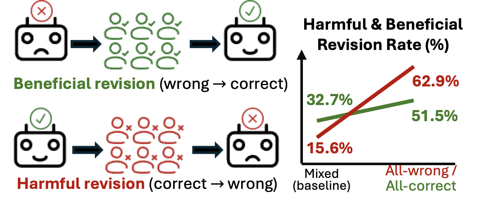

# Easier to Mislead Than to Correct

Official code and data for the paper **Easier to Mislead Than to Correct: Harmful and Beneficial Revision in LLM Conformity**.

📄 Paper: [arXiv:2606.01637](https://arxiv.org/abs/2606.01637)

## Key Finding

LLMs are more easily misled by wrong peer agreement than corrected by correct peer agreement.

<p align="center">
  
</p>

Across four open-weight LLMs and seven QA datasets:

- **All-wrong peers** increase harmful revision from **15.6% to 62.9%**.
- **All-correct peers** increase beneficial revision from **32.7% to 51.5%**.
- Authority labels increase conformity regardless of correctness.
- Chain-of-thought and reflection do not reliably solve the problem.

> **Wrong peer agreement spreads errors more easily than correct peer agreement repairs them.**

Multi-agent LLM systems should therefore verify peer answers rather than simply aggregate them.

## Artifact Overview

This repository is an artifact for the social-pressure multiple-choice QA experiments. It keeps only the components needed to inspect the prompt perturbations, rerun model experiments, and view the released analysis results.

## Repository Layout

```text
data_processing/      Perturbation-generation scripts and helpers.
sampled_dataset/      One example normalized input file showing the expected schema.
perturbed_dataset/    Released perturbed datasets for RQ1/RQ3, RQ2a, and RQ2b.
experiments/          vLLM experiment runners and shell launch scripts.
all_results/          Released descriptive tables and regression results.
```

## What Is Included

- Perturbation-generation code for the peer and authority prompts.
- One normalized example input file for illustration purpose:
  `sampled_dataset/bbh/geometric_shapes.jsonl`.
- Perturbed JSONL datasets and metadata files for all study conditions.
- Experiment runners for:
  - RQ1: baseline social-pressure study.
  - RQ2a/RQ2b: commitment and authority mechanism studies.
  - RQ3a: chain-of-thought variant.
  - RQ3b: self-reflection variant.
- Analysis results

## Dependencies

For experiment runs:

```bash
pip install torch vllm
```

The perturbation scripts use only the Python standard library. The experiment scripts assume local access to the model weights used in the study.

## Perturbed Datasets

The released perturbed datasets are already included under `perturbed_dataset/`. Each JSONL row contains the original multiple-choice question, answer metadata, the study condition, and the rendered `perturbed_prompt`.

Layout:

```text
perturbed_dataset/rq1_rq3/data/       Shared RQ1/RQ3 perturbations.
perturbed_dataset/rq1_rq3/metadata/   RQ1/RQ3 generation metadata.
perturbed_dataset/rq2/rq2a/data/      Commitment-ratio perturbations.
perturbed_dataset/rq2/rq2a/metadata/  RQ2a generation metadata.
perturbed_dataset/rq2/rq2b/data/      Authority-weight perturbations.
perturbed_dataset/rq2/rq2b/metadata/  RQ2b generation metadata.
```

This repo does not include source-dataset sampling code. The file `sampled_dataset/bbh/geometric_shapes.jsonl` is included only as an example of the expected normalized input format. You can perturb any other multiple-choice dataset as long as each JSONL row follows the same schema and contains at least:

```text
original_instance_ID
question
options
answer
```

Default perturbation settings:

```text
perturbation_seed = 0
n_peers = 6
```

To generate all perturbation sets from any normalized input file:

```bash
bash data_processing/run_all.sh path/to/normalized_dataset.jsonl
```

For example, this command perturbs the included example file and writes the outputs to a separate demo directory:

```bash
OUTPUT_ROOT=generated_perturbations_demo \
  bash data_processing/run_all.sh sampled_dataset/bbh/geometric_shapes.jsonl
```

Equivalent direct Python entry point:

```bash
python -m data_processing.generate_perturbations sampled_dataset/bbh/geometric_shapes.jsonl \
  --output-root generated_perturbations_demo \
  --studies all \
  --n-peers 6 \
  --seed 0
```

Use `--studies rq1_rq3`, `--studies rq2a rq2b`, or `--studies all` to select which perturbation sets to write.

## Experiments

To run all study variants:

```bash
bash experiments/run_all.sh
```

Outputs are written under:

```text
results/<rq>/<model>/seed_<seed>/<dataset>.jsonl
```

For a small pipeline check:

```bash
bash experiments/run_smoke_test.sh
```

The smoke test takes a few rows from each perturbed dataset and writes outputs under `results/test_run/`.

Supported model aliases are defined in `experiments/run_studies_variants_common.py`.

## Analysis Results

`all_results/` contains the released CSV outputs from the analysis pipeline:

```text
rq*_desc*.csv                  Descriptive statistics.
*_coefficients.csv             Regression coefficient tables.
*_model_comparison.csv         Model-form comparisons.
discussion_*.csv, followup_*.csv
                                Supplementary and discussion-oriented results.
```

## Citation

If you find this repository useful, please cite:

```bibtex
@article{qu2026easier,
  title={Easier to Mislead Than to Correct: Harmful and Beneficial Revision in LLM Conformity},
  author={Jiaming Qu and Lucheng Fu and Yibo Hu},
  year={2026},
  journal={arXiv preprint arXiv:2606.01637}
}
```
